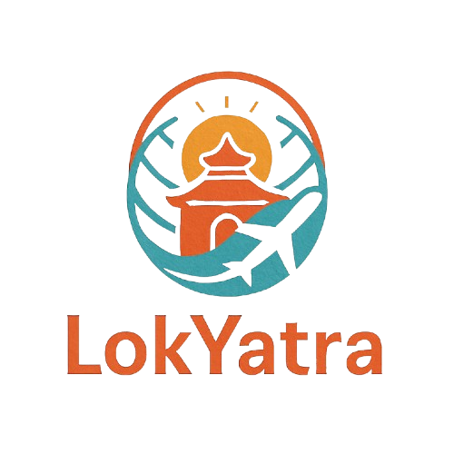

<div align="center">
  
  
  # LokYatra
  
  **Explore Nepal's Cultural Heritage**
  
  [](https://flutter.dev/)
  [](https://dart.dev/)
  [](https://dotnet.microsoft.com/)
  [](LICENSE)
  
  *A comprehensive tourism platform connecting travelers with Nepal's ancient temples, mountains, cultural landmarks, and authentic homestay experiences.*

</div>

---

## 📖 About

LokYatra is a mobile application designed to promote and preserve Nepal's rich cultural heritage while providing travelers with authentic local experiences. The platform connects tourists with heritage sites, local homestays, and cultural knowledge through interactive features.

### ✨ Key Features

| Feature | Description |
|---------|-------------|
| 🏛️ **Heritage Discovery** | Explore ancient temples, mountains, and cultural landmarks across Nepal |
| 🏠 **Homestay Booking** | Stay with local families near heritage sites for authentic experiences |
| 👤 **Multi-Role System** | Separate interfaces for Tourists, Homestay Owners, and Administrators |
| 📊 **Admin Dashboard** | Comprehensive management for users, bookings, payments, and content |
| 🧠 **Cultural Quizzes** | Learn about Nepal's heritage through interactive quizzes |
| 📱 **Cross-Platform** | Available on Android, iOS, Web, and Desktop |

---

## 🏗️ Project Structure

```
LokYatra/
├── frontend/
│   └── lib/                  # Flutter application source code
│
└── backend/
    └── LokYatra.sln          # . NET API server solution
```

---

## 🚀 Getting Started

### Prerequisites

- **Flutter SDK** (3.x or higher)
- **Dart SDK** (3.x or higher)
- **.NET SDK** (for backend)
- **Android Studio** / **Xcode** (for mobile development)

### Installation

#### 1. Clone the Repository

```bash
git clone https://github.com/karkisaroj/LokYatra.git
cd LokYatra
```

#### 2. Frontend Setup

```bash
cd frontend
flutter pub get
flutter run
```

**Run on specific platform:**

```bash
# Android
flutter run -d android

# iOS
flutter run -d ios

# Web
flutter run -d chrome

# Desktop
flutter run -d windows  # or macos, linux
```

#### 3. Backend Setup

1. Open `backend/LokYatra.sln` in Visual Studio
2. Restore NuGet packages
3. Configure the database connection string in `appsettings.json`
4. Run the application (F5 or Ctrl+F5)

---

## 📱 User Roles

### 🧳 Tourist
- Browse heritage sites and cultural landmarks
- Search and book homestays
- Participate in cultural quizzes
- View stories and cultural content

### 🏠 Homestay Owner
- Manage property listings
- Handle booking requests
- View booking history and payments

### 👨‍💼 Administrator
- Dashboard with analytics overview
- User management
- Manage heritage sites and homestays
- Handle bookings and payments
- Manage quizzes, stories, and reviews
- Generate reports
- System settings

---

## 🛠️ Tech Stack

| Layer | Technology |
|-------|------------|
| **Frontend** | Flutter, Dart |
| **State Management** | BLoC Pattern |
| **Backend** | .NET Web API |
| **UI Responsiveness** | flutter_screenutil |
| **Authentication** | JWT Tokens |

---

## 🤝 Contributing

Contributions are welcome! Please follow these steps:

1. Fork the repository
2. Create a feature branch (`git checkout -b feature/AmazingFeature`)
3. Commit your changes (`git commit -m 'Add some AmazingFeature'`)
4. Push to the branch (`git push origin feature/AmazingFeature`)
5. Open a Pull Request

---

## 📄 License

This project is licensed under the MIT License - see the [LICENSE](LICENSE) file for details.

---

## 📞 Contact

**Saroj Karki** - [@karkisaroj](https://github.com/karkisaroj)

Project Link: [https://github.com/karkisaroj/LokYatra](https://github.com/karkisaroj/LokYatra)

---

<div align="center">
  
  **Made with ❤️ for Nepal's Cultural Heritage**
  
  ⭐ Star this repository if you find it helpful!
  
</div>
